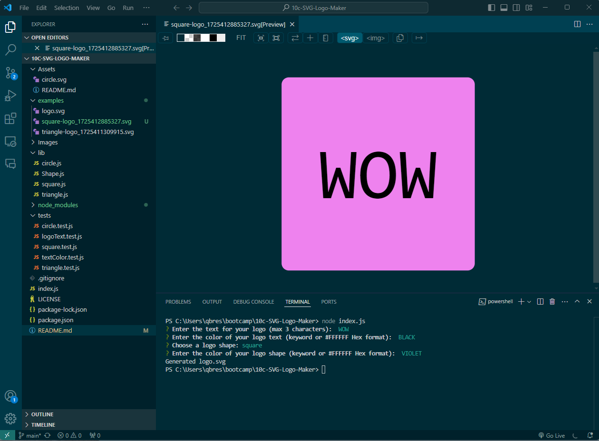

# 10c-SVG-Logo-Maker

## Description

This SVG Logo Maker app is a valuable tool for developers and designers who need to quickly create custom SVG logos. By providing a user-friendly terminal interface, the app eliminates the need for complex code editing or design software. Users can easily input their desired logo elements, such as shapes, text, and colors, and the app generates a tailored SVG file ready for integration into web projects or other applications. 

## Installation

This app was developed for use within the Visual Studio Code terminal. It requires the installation of Node.js to run the app in the terminal.

A link to the demo can be accessed here:
https://drive.google.com/file/d/1zpl-HqDog6lPyWBvuPHoaesDZG4z2gdj/view?usp=drive_link

The online repository with all code files can be accessed here:
https://github.com/qbres333/10c-SVG-Logo-Maker

## Features

User can enter logo criteria like the logo text, text color, logo shape, and shape color into the terminal using the instructions presented. Colors can be entered as either 6-digit hexadecimal code or as basic/extended color keywords. The SVG file will generate with the shape name and Unix timestamp in the title when they have answered all questions in the terminal, and the file will be saved to the "examples" folder in the directory.

## Usage

This app streamlines the logo creation process, saving time and effort while ensuring consistent quality and flexibility.

## Credits
Input Validation:
https://github.com/SBoudrias/Inquirer.js/blob/main/packages/input/README.md

Basic & Extended Color Keywords:
https://www.w3.org/TR/css-color-3/#numerical

SVG Shapes:
https://developer.mozilla.org/en-US/docs/Web/SVG/Tutorial/Basic_Shapes

## License

MIT License (located in root directory):
https://github.com/qbres333/10c-SVG-Logo-Maker
